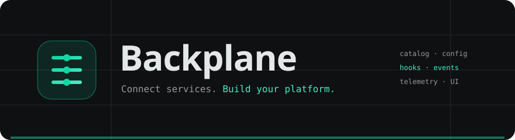
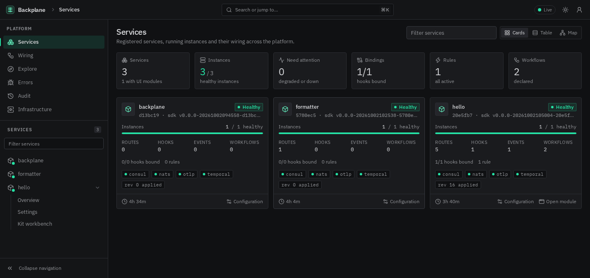

<div align="center">



<br/>

**A control plane for your services** — typed configuration, hooks and events,
workflows, API discovery, telemetry and one console for the whole installation.

<br/>

[](https://github.com/gopherex/backplane/actions/workflows/ci.yml)
[](https://github.com/gopherex/backplane/releases)
[](https://github.com/gopherex/backplane/actions/workflows/release.yml)
[](https://go.dev)
[](web/README.md)
[](https://github.com/gopherex/backplane/pkgs/container/backplane)
[](LICENSE)

**[Quickstart](#quickstart)** ·
[Deployment](deployments/README.md) ·
[Go SDK](pkg/backplane) ·
[Frontend SDK](web/README.md) ·
[API reference](docs/api-reference.md) ·
[Releases](https://github.com/gopherex/backplane/releases)

</div>

---

Backplane connects services that use its Go SDK and gives operators a live view
of their contracts, instances and configuration. Services own their APIs and UI
modules; the platform supplies routing, a shared component kit and the console.
It does not deploy services or replace your orchestrator.



## Quickstart

Requirements: Go 1.26, Node.js 24, Yarn 1.22.22 and Docker Compose. Gopherex
frontend dependencies come from GitHub Packages; configure a token with package
read access in your user [package-manager configuration](web/README.md).

```sh
git clone https://github.com/gopherex/backplane.git
cd backplane
make configure
make dev
```

Open **http://127.0.0.1:10000/backplane/** and sign in with the local operator
token **`dev-admin-token-change-me`**. The installation includes backplane, hello
and formatter, with a working hook binding and event rule. Infrastructure,
including Temporal, runs in containers.

For the console with only PostgreSQL, Consul and Valkey:

```sh
make dev-minimal
```

Open **http://127.0.0.1:8081/backplane/**. NATS, Temporal and observability
capabilities stay disabled until their endpoints are configured.

The Compose defaults are for local development. For shared deployments, set
your own credentials and secrets and expose the console through HTTPS.
See [development](docs/development.md) and [deployment](deployments/README.md).

## What it gives you

| Capability | What operators and module authors get |
| --- | --- |
| **Service catalog** | Live instances, readiness, versions, routes and service-owned UI pages |
| **Configuration** | Schema forms, validation, defaults, secret masking and live overrides |
| **API discovery** | HTTP/OpenAPI, protobuf RPC and GraphQL documents; bundled schemas and examples |
| **Hooks and events** | Typed bindings, CEL expressions, execution history and event rules |
| **Workflows and schedules** | Workflow runs and server-side administrative schedule management |
| **Audit** | Durable PostgreSQL records and API queries; optional delivery as OTel logs |
| **Observability** | OTLP admission/proxy and Victoria queries for metrics, logs, traces and errors |
| **Infrastructure** | Component availability in the console, including disabled and failed dependencies |
| **Frontend kit** | React, shared light/dark tokens, themed shadcn primitives and Grafana adaptations |

## Use it in a service

```sh
go get github.com/gopherex/backplane
```

The Go SDK manages identity, manifests, listeners, probes, configuration and
lifecycle. Optional drivers supply events and workflow execution. A service
can run without the platform; deployments opt into Consul registration, NATS,
Temporal and OTel. Start with the [hello example](examples/hello), its
[formatter counterpart](examples/formatter), and the [example guide](examples/README.md).

Module authors develop and serve their UI locally with `yarn dev` or a
container. They do not need to start the platform. The platform embeds the
module at deployment time through the shared routing and SDK contract.
See the [author template](web/templates/module/README.md),
[package contract](docs/frontend-platform.md) and [UI kit](docs/ui-kit.md).

## Install a release

Tagged releases publish **Linux amd64 and arm64** images to
`ghcr.io/gopherex/backplane`, plus archives containing the server and the ready
console. The release page carries checksums, the image digest and all 13
frontend package tarballs. Frontend packages publish to **GitHub Packages**.

```sh
docker pull ghcr.io/gopherex/backplane:0.1.0
```

The image runs as a non-root user. Supply PostgreSQL, Consul, Valkey and an
operator token through deployment configuration; optional infrastructure is
enabled by its configured endpoints. See [release packaging](docs/releases.md)
and [configuration](deployments/README.md). The publishing workflow runs on
`vX.Y.Z` tags; a manual run rehearses builds without publishing.

## Layout

| Path | Purpose |
| --- | --- |
| [`pkg/backplane`](pkg/backplane) | Go service SDK and driver interfaces |
| [`cmd/backplane`](cmd/backplane) | Platform server |
| [`backplanepb`](backplanepb) | Protobuf contracts and generated Go API |
| [`internal`](internal) | Catalog, console, storage, routing, audit and telemetry |
| [`web/packages`](web/packages) | Coordinated TypeScript API, SDK and UI packages |
| [`web/apps/embedding`](web/apps/embedding) | Production console host |
| [`web/apps/catalog`](web/apps/catalog) | Storybook component catalog |
| [`examples`](examples) | Hello and formatter services with real contracts |
| [`deployments`](deployments) | Container builds, Envoy and OTel configuration |
| [`docs`](docs) | Architecture, API and development guides |

## Develop

```sh
make help          # available targets
make gen           # generated Go/TS APIs and store code
make dev           # complete local installation
make dev-ui        # component catalog fixture
make dev-module    # module template without the platform
make test          # Go tests
make check         # explicit full verification
make release       # create and push a tag; no local builds or tests
```

Ordinary CI selects checks from changed paths. Full stack verification is an
explicit manual run. See [verification](docs/development.md#ci-and-release-verification).

## License

[MIT](LICENSE). UI integrations retain their upstream notices in the packages.
