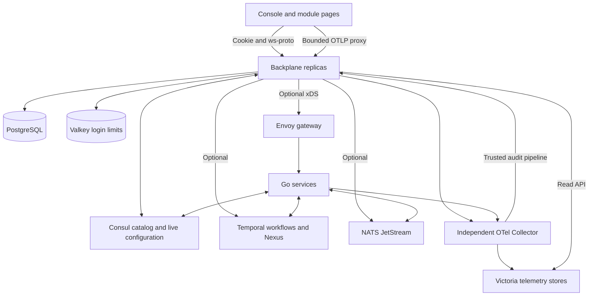

# Architecture

Backplane has three cooperating surfaces: a service SDK, an installation control plane and a browser console. The SDK announces service capabilities. The control plane stores operator intent and reconciles it with the installation. The console reads those contracts and provides both administration and module pages.

## Ownership

| Owner | Responsible for |
| --- | --- |
| Service author | Domain behavior, payloads, schemas, activities, hooks, events, workflows, public APIs, module pages |
| Platform | Discovery, versioned intent, reconciliation, API authentication, wiring execution, control audit, console host |
| Deployment | Processes and containers, credentials, TLS, routing boundaries, enabled runtimes, Collector pipelines, retention and storage capacity |
| Operator | Live configuration, binding/rule definitions, workflow and schedule commands, investigation |

Services are independently built. A consumer can define compatible JSON payload types without importing another service's Go package. The hello/formatter examples exercise that boundary.

## Control plane and data plane

PostgreSQL stores authoritative control state and audit. Consul supplies registration, health and the distributed configuration view used by services. Reconciliation bridges committed operator intent and runtime state; UI status distinguishes a saved revision from one applied by an instance.

Public application requests normally travel through Envoy to services. The console's authenticated internal API relay is a separate path. The server proxies module assets so embedded modules load from the console origin; it does not build or deploy those modules.

Temporal provides durable workflow execution and Nexus dispatch when enabled. NATS JetStream provides durable event delivery when enabled. Neither is required to run the core SDK in standalone mode. [Dependency modes](dependencies.md) explain which platform capabilities disappear when a runtime is absent.

## Independent telemetry

The Collector and Victoria stores form an independently managed OTel deployment. Backplane forwards admitted OTLP requests and queries configured stores. It does not reinterpret each telemetry point or maintain a second telemetry database. Audit is a deliberate exception: control and trusted application audit are durable records in PostgreSQL.

## Identity and versions

Service names identify contract owners. Instances identify running processes. A versioned manifest describes public routes, schemas, hooks, activities, events, workflows, internal RPCs and optional UI/telemetry declarations. Build identity is stamped into the service binary; it should change when its manifest changes.

Current and historical manifests can coexist during rolling updates. Stopping a service does not delete its historical manifest. Owned Nexus endpoints are retired only after confirmed absence and a grace period; unhealthy instances still count as present. See [availability](../deploying/availability.md).
