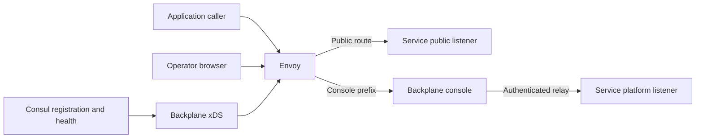

# Gateway and service discovery

Backplane can generate Envoy configuration from registered service routes. Envoy handles public traffic; Backplane supplies xDS over its configured listener. The gateway is optional and is not a general service mesh controller.

## Request paths

Managed HTTP/gRPC endpoints and independently owned listeners both need accurate route metadata. The latter are only announced: the SDK does not start them on your behalf.

## Addresses and ports

A bind address tells the process where to listen. An advertised address tells other processes where to connect. `localhost` inside a container refers to that container, so do not advertise it to a gateway in another container. Use routable container/service addresses and stable declared ports.

The example topology exposes gateway HTTP on port 10000 and its admin interface on a development-only address. Backplane's xDS listener defaults to 18000. Keep administrative listeners private and follow the [configuration reference](../reference/configuration.md) for actual mappings.

## Route policy

Route declarations carry protocol, prefix/host, target port and supported policy such as timeout, CORS and request bounds. Streaming methods need suitable timeouts. The console requires WebSocket upgrade forwarding; API schema and plugin assets must retain the configured console prefix.

Public service authentication remains the service/deployment's responsibility. Console cookie authentication protects the administrative console and relay, not every public application route.

## Deployment and verification

Use the supplied Envoy bootstrap as a reference and point it at the actual Backplane xDS address. With no gateway, set `BACKPLANE_XDS_ENABLED=false`; do not leave a required listener/probe configured for an integration you omitted.

Verify one HTTP route and each protocol you rely on. Check the service's advertised target and Consul health before investigating the browser. `make test-envoy` exercises generated routing with the reference topology. The development Compose overlay targets the container Backplane, while host-process conformance uses the host topology; do not mix them.
