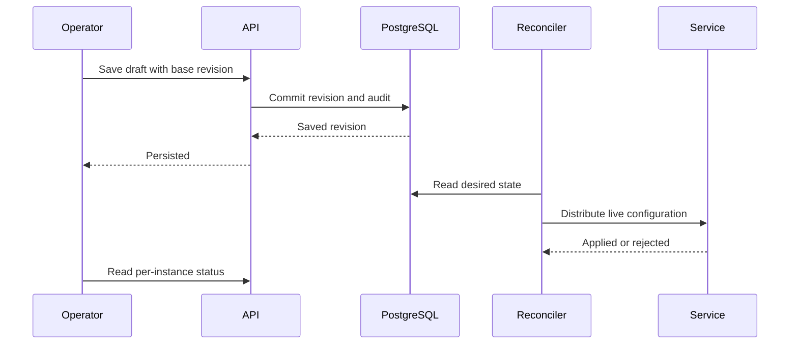

# Change and roll back configuration

The platform stores revisioned service configuration. A reconciler distributes the desired live fields; each instance reports whether it applied or rejected the revision.

## Edit

1. Open the service's Configuration view.
2. Read the current revision and schema. Edit live fields; startup-only fields require deployment changes.
3. Correct schema/default/CEL validation errors before saving.
4. Save against the revision you read.
5. Inspect every active instance's application status. If rejected, read its reason and correct the candidate.

For hello, `greeter.suffix` and `greeter.excited` are live. `greeter.salute` is a startup field. A suffix longer than eight characters is rejected by hello's custom validator even if a broader schema allowed the value.

## Concurrent edits

The save carries a base revision. If another operator saved first, read the latest configuration and compare changes. Rebase the draft intentionally. Do not silently overwrite the newer revision or assume an HTTP/RPC retry is harmless.

## Rollback

Open the desired historical revision, review the diff and request rollback. Rollback records new operator intent; it does not erase history. Check per-instance status again because the old value can be incompatible with a newer service version.

## Secrets and audit

Masked fields must not be copied as literal secret values. Control audit records changed key names and revision identifiers, not configuration values or revision comments. Application logs and validators remain responsible for avoiding secret disclosure.

See [ConfigService](../reference/services/config-service.md) for request fields, errors and snapshot watches, and [SDK configuration](../sdk/configuration.md) for author behavior.
