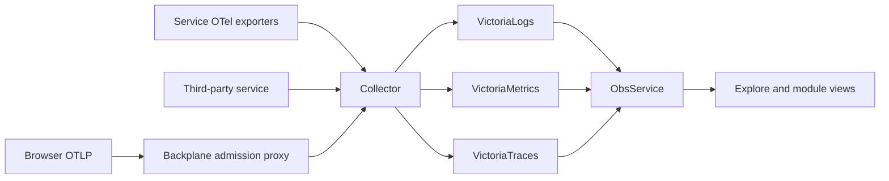

# Logs, metrics and traces

Backplane queries an independently deployed telemetry stack. Services and external applications can emit ordinary OpenTelemetry without declaring a module. The platform's optional OTLP proxy performs bounded admission and forwarding; the Collector performs processing and export.



## Sources without declarations

Discovery reads stored resource identity: `service.namespace`, `service.name` and `service.instance.id`. Missing fields remain missing. A third-party identity server and its wrapper can both appear even if only the wrapper registers with Backplane.

An author may provide related presets:

```go
svc.TelemetrySources(
    map[string]string{"service.namespace": "identity", "service.name": "wrapper"},
    map[string]string{"service.namespace": "identity", "service.name": "kratos"},
)
```

Maps are OR alternatives, with exact AND matches inside each. Deployment overrides take precedence over declarations; absent declarations fall back to the service-name convention. Explicit empty selectors disable presets. None of this restricts ingestion or global discovery. Namespaces are organization, not tenant authorization.

## Query languages

| Signal | Language and behavior |
| --- | --- |
| Logs | LogsQL, including statistics queries |
| Metrics | MetricsQL and compatible PromQL; instant or range query |
| Raw spans | LogsQL against the traces backend |
| Trace search | TraceQL only when deployment advertises support |

The pinned VictoriaTraces profile supports basic TraceQL search, not full Tempo parity or TraceQL metrics. Read `GetObsCapabilities` before offering language choices. The API passes native expressions to the selected backend; it does not translate languages.

## Explore

Choose signal and time range, then source/field filters or a native expression. The builder rewrites the expression, which remains editable. A metrics view initially offers a generated dashboard; selecting a panel opens its query. Logs provide volume, lines and a detail drawer. Trace results open a span tree, timing ruler, attributes, events, links and related logs.

Query bounds use exact nanoseconds. Backend samples and large integers remain exact text where appropriate. A truncated/partial result is labeled; narrow the query or range before concluding that missing data never existed.

## Deployment bounds

Each query has timeout, concurrency, response-size, expression, range and result limits. Backends need their own execution/memory budgets as well. Overload is an explicit error, not an empty success. A store outage fails queries without making the whole platform unready.

OTLP admission separately limits compressed and decoded size, active requests and source rate. Collector transformations, redaction, persistent queues, storage retention and credentials remain deployment configuration. See [OTLP reference](../reference/otlp.md) and [read API](../reference/observability-api.md).
