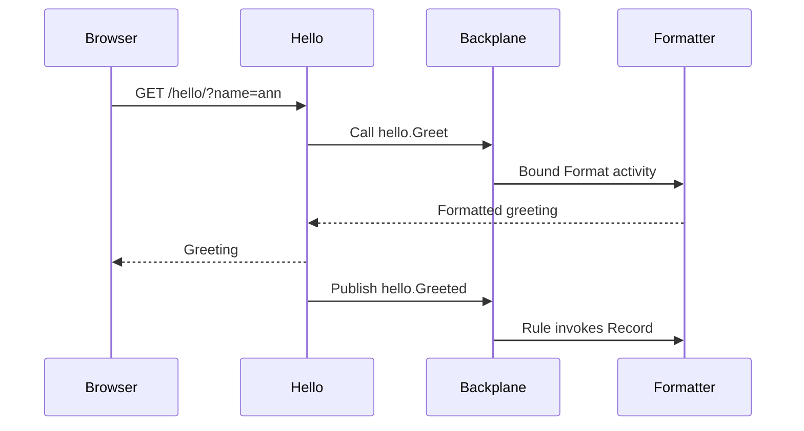

# Run a complete installation

This walkthrough starts Backplane, hello and formatter with containerized infrastructure. It demonstrates a cross-service hook, an event rule, live configuration, module pages and telemetry.

## Prerequisites

- Docker with Compose and permission to use the Docker daemon.
- Go 1.26, Node 24 and Yarn 1.22.22.
- Git and GitHub Packages read credentials for the `@gopherex` packages.

Configure the registry in your user package-manager configuration. Keep the token in the environment or your credential manager; never commit it:

```ini
@gopherex:registry=https://npm.pkg.github.com
//npm.pkg.github.com/:_authToken=${NODE_AUTH_TOKEN}
```

The token needs package read access. GitHub Packages requires authentication even for public npm packages. The published container is public and does not require these credentials at runtime.

```bash
git clone https://github.com/gopherex/backplane.git
cd backplane
git checkout v0.1.1
make configure
make dev
```

`make dev` builds the console, module bundles and Go binaries, starts the Compose installation, waits for registration and health, creates a named binding and rule, then sends a greeting. Temporal runs inside Compose. No host Temporal process is needed.

## Open the console

Open **http://127.0.0.1:10000/backplane/**. The local development operator credential is `dev-admin-token-change-me`; set `DEV_ADMIN_TOKEN` before starting the stack to change it. This is a development default, not a production credential.

Login creates an HttpOnly cookie. The frontend does not store the operator token. Services is the landing page; the sidebar also exposes platform tools and module-owned pages.

## Exercise the connected services

```bash
curl --fail 'http://127.0.0.1:10000/hello/?name=ann'
curl --fail 'http://127.0.0.1:10000/formatter/'
```

The greeting should use formatter's output (`Welcome, ann!` with default configuration). Formatter's statistics show activity, rule and reactor work. Event processing is asynchronous: refresh the statistics after delivery.



In Services, open **hello**:

1. Inspect its instances and declared routes.
2. Open **API** and inspect HTTP operations, protobuf messages and GraphQL types. These are reference pages, not a request execution console.
3. Change the live `greeter.suffix` configuration and check per-instance application status. A saved revision is not proof that every instance accepted it.
4. Open Wiring to inspect `hello.Greet → formatter.Format` and the `hello.Greeted` rule.
5. Open the module's pages from the hello group in the left sidebar. Its sample settings form intentionally stores only local component state.
6. Inspect Telemetry, Audit and Errors. Telemetry can arrive after exporter and Collector batching delays.

## Logs, shutdown and restart

```bash
make dev-logs
make dev-down
```

Shutdown retains volumes. Running `make dev` again rebuilds services and reapplies the named example wiring; it does not reset the database. For the smallest console installation use `make dev-minimal` after stopping the full stack; see [dependency modes](concepts/dependencies.md).

For frontend-only iteration against the running backend:

```bash
cd web
yarn dev:console
```

Open **http://127.0.0.1:5173/backplane/**. For a module without any platform, run `yarn dev:module` instead. See [development details](reference/development.md) for targets, ports and acceptance commands.
