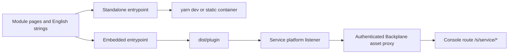

# Build and serve a module UI

A module owns its page content and relative routes. The platform owns the outer header, sidebar, session, router and shared providers. The same page definitions run standalone for development and embedded in a deployment.



## Start without the platform

In the repository:

```bash
cd web
yarn install --frozen-lockfile
yarn dev:module
```

The template supplies explicit local fixtures. It does not need Backplane, PostgreSQL, Consul, NATS or Temporal. An independent module project uses the same published packages and runs `yarn dev` in its own directory. Its backend fixtures, ports and local data belong to that project.

Copy the [template](https://github.com/gopherex/backplane/tree/master/web/templates/module) as the reference structure, update the service name and English namespace, and use registry versions instead of workspace assumptions. The template's standalone entrypoint owns providers; its embedded entrypoint consumes them.

## Declare navigation and routes

`plugin.config.json` contributes leaves under the service group:

```json
{
  "service": "hello",
  "nav": [
    { "path": "", "labelKey": "overview" },
    { "path": "settings", "labelKey": "settings" }
  ]
}
```

The React definition supplies matching routes:

```tsx
export const definition = definePlugin({
  ...navigation,
  routes: [
    { index: true, element: <Overview /> },
    { path: 'settings', element: <Settings /> },
    { path: '*', element: <Missing /> },
  ],
});
```

`navigation`, pages and imports are provided by the template. Use `usePluginNavigate()` for module-relative navigation. Do not hard-code the console prefix or `/s/hello` into page code. Platform service administration lives separately under `/services/:service/*`.

## Use APIs and report errors

Use `useClient` for both generated platform clients and your generated internal service client. The host owns the authenticated socket. `usePlatformQuery` cancels stale work and protects against showing a previous session's data. `usePlatformAction` prevents duplicate in-flight submission but does not retry a mutation whose outcome is unknown.

Use `usePluginErrorReporter()` for handled errors. Unhandled and render errors flow through the host's reporting boundary. Avoid capturing credentials or unrestricted application state; the browser error package supports filtering and sanitization.

## Build and serve

The template build produces `dist/standalone` and `dist/plugin`. The standalone site needs SPA fallback for deep links and can use the template's ready Dockerfile. The remote is served by the module's service:

```go
//go:embed dist
var assets embed.FS

bundle, err := fs.Sub(assets, "dist")
if err != nil { return err }
svc.UI(bundle)
```

Place the plugin build in the embedded directory before compiling the service. Keep the standalone site separate from the embedded remote. The service announces the bundle; Backplane authenticates and proxies it from the console origin.

## Compatibility and trust

The build contract enforces compatible shared runtime packages and `sdk_major`. React, router and provider contexts must be host singletons. Assets use relative paths so a non-root console prefix works. Test lazy chunks, CSS, icons and deep links under the production CSP, not only Vite.

Modules are trusted JavaScript in the console origin. The route contract is not an isolation sandbox for hostile code. Review a module before deployment and never place operator credentials in its bundle.

The [template reference](../reference/module-template.md) gives container commands and packed-consumer acceptance. [Development](../reference/development.md) covers host HMR and the live installation.
